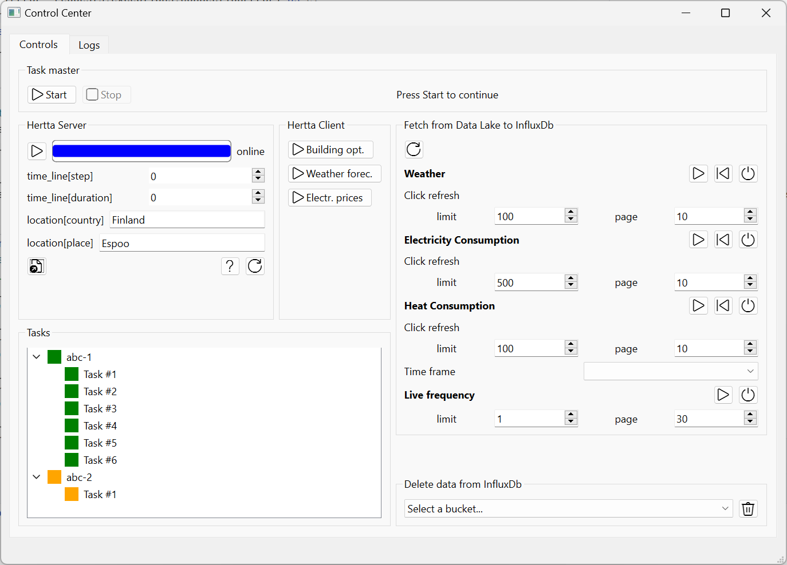
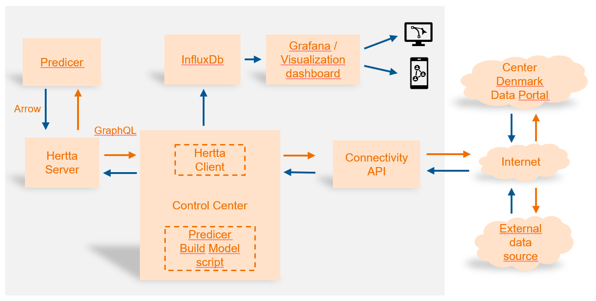
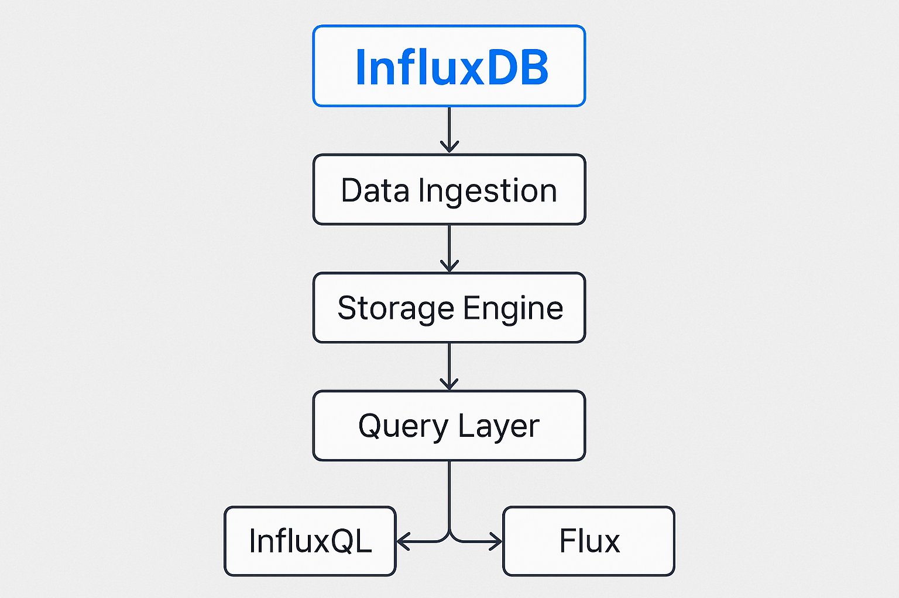
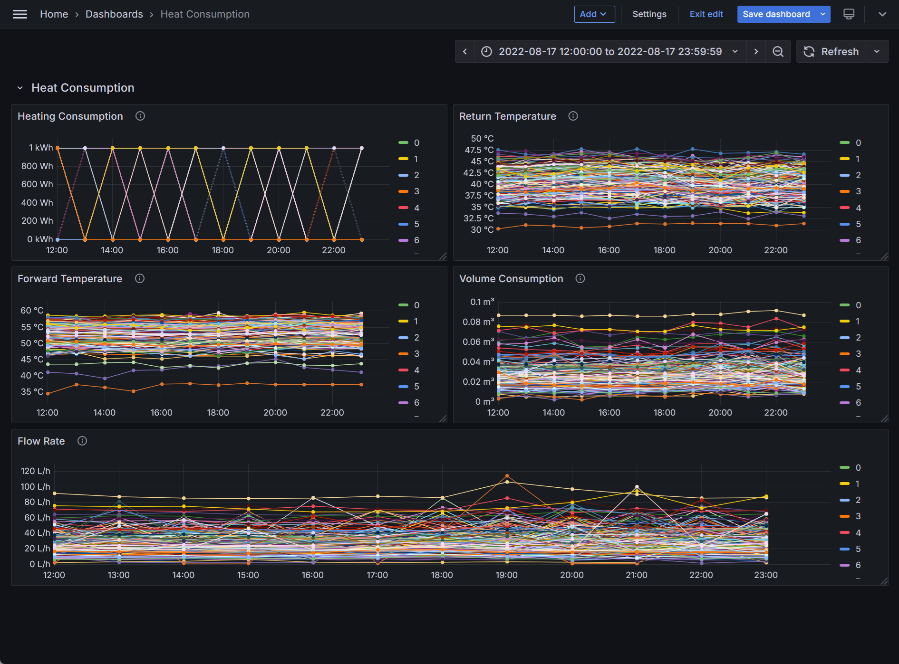
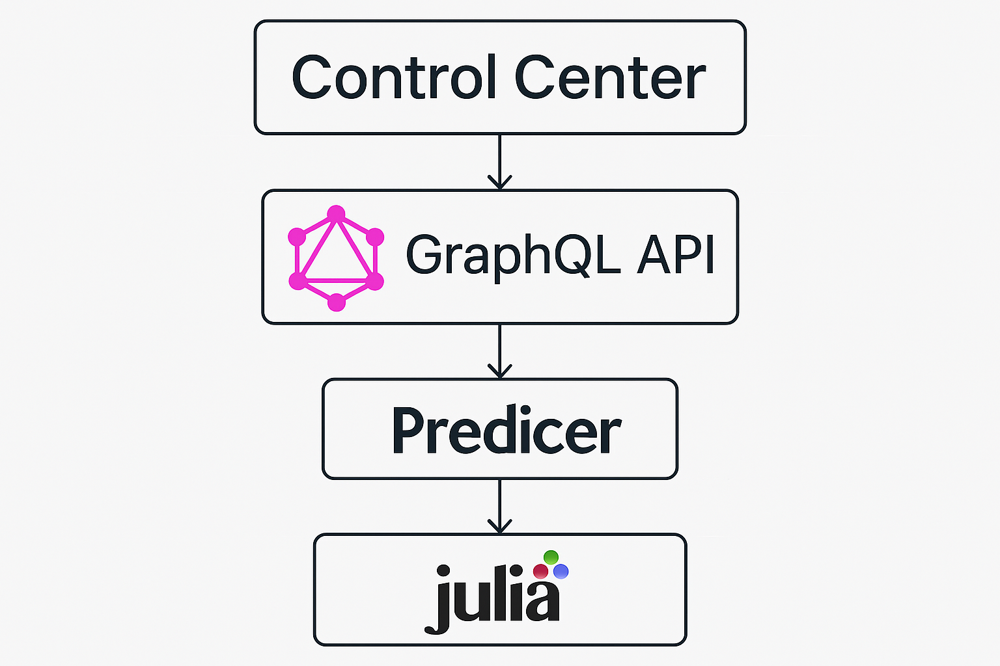

# Welcome to Predicer Control Center Documentation

Control center is a cross-platform desktop application for running 
[Predicer](https://github.com/predicer-tools/Predicer). It supports fetching input data from [Center Denmark
Dataportal](https://portal.centerdenmark.com/da-DK/), storing it into InfluxDB and displaying it in a Grafana 
dashboard. The input data can be fetched from other sources as well. Control center sends the input data to the 
Predicer model for processing and once it's finished, retrieves the output data and stores it into files or sends
it to Grafana via InfluxDB for displaying.

<figure markdown="span">
    { width="100%" }
  <figcaption><i>Control Center (draft)</i></figcaption>
</figure>

## 1. Overview
**Name:** Predicer Control Center  
**Purpose:** A desktop application for using Predicer.  
**Status:** alpha  
**Repo(s):** https://github.com/predicer-tools/control-center  
**Lead developer/Maintainer:** Pekka Savolainen (Research Scientist, VTT)  
**Developers:** Pekka Savolainen (VTT), Essi Nousiainen (VTT), Dennis Sundell (VTT), 
Antti Soininen (VTT), Esa Pursiheimo (VTT)  

## 2. Architecture
- UI Layer
    - PySide6
- Core Logic
    - Python (business logic, data processing)
- Inter-process Communication (IPC)
    - InfluxDB server/client architecture
    - Grafana server/client architecture
    - GraphQL
- Database
    - InfluxDB
- Auth
    - Credentials required for Center Denmark Data Portal and InfluxDB
- Packaging / Build
    - PyInstaller
- Deployment:
    - Distributed as a Windows installer (.msi or .exe with NSIS)

The picture below depicts the main software components related to the Control Center Graphical User 
Interface and how they interact with each other from a data flow perspective. 

<figure markdown="span">
    { width="100%" }
  <figcaption><i>Software components of the Predicer Control Center</i></figcaption>
</figure>

## 3. Installation instructions
See installation instructions in the Control Center repository (https://github.com/predicer-tools/control-center).

## 4. Core Features

**Feature A**: Retrieving input data from data portal and other sources  
**Feature B**: Storing data to InfluxDB  
**Feature C**: Viewing data using Grafana  
**Feature D**: Communicating input/output data with Predicer using GraphQL  
**Feature E**: Exploiting Predicer output data  

### Feature A: Retrieving input data from data portal and other sources

Retrieving input data from data portal requires that you have an active account in [Center Denmark
Dataportal](https://portal.centerdenmark.com/da-DK/). You also need to create a personal token on the site, when
logged in. The Control Center won't be able to retrieve data from the portal without a token. See further instructions
on how to pass tokens for the Control Center in the installation instructions. The Control Center needs to know the
name of the dataset and other settings, which determine, what data is read from the data portal, from what time period,
and the amount of data. When the data arrives to the Control Center, it is written into InfluxDB. For this, the user 
needs to have an installation of InfluxDB, and a token for access. Consult the installation instructions to get this 
part working.

### Feature B: Storing data to InfluxDB

InfluxDB is a high-performance time-series database designed to store and query large volumes of timestamped 
data efficiently. It organizes data into measurements, tags, fields, and timestamps, enabling fast retrieval and 
aggregation of time-based metrics. InfluxDB uses a columnar storage engine optimized for time-series workloads and 
supports powerful query capabilities through InfluxQL or Flux. Common use cases include monitoring, IoT data 
collection, and real-time analytics, where high write throughput and low-latency queries are essential.

<figure markdown="span">
    { width="100%" }
  <figcaption><i>InfluxDB architecture</i></figcaption>
</figure>

There are a lot of options for data ingestion to InfluxDB, such as telegraf, HTTP, gRPC, and line protocol, but the 
Control Center uses a Python InfluxDB client library to ingest data. As mentioned above, the downloaded data from 
Data Portal is stored into InfluxDB. InfluxDB can also be used to store the output data from Predicer. 

### Feature C: Viewing data using Grafana

Even though it is possible to build simple dashboards using InfluxDB's own features, we have elected to use Grafana 
instead. Grafana integrates with InfluxDB to provide powerful visualization and monitoring capabilities for 
time-series data. InfluxDB acts as the data source, storing metrics and events, while Grafana connects to it via a 
plugin or data source configuration. Grafana queries InfluxDB using InfluxQL or Flux, then transforms the results 
into interactive dashboards with charts, graphs, and alerts. This combination is widely used for observability, IoT 
analytics, and performance monitoring, enabling users to explore historical trends and real-time data in a highly 
customizable interface.

Below is an example of a Grafana dashboard with historical data downloaded from the Data Portal using Control Center. 
The implementation uses Flux as the query language.

<figure markdown="span">
    { width="100%" }
  <figcaption><i>Grafana dashboard with data downloaded from Data Portal</i></figcaption>
</figure>

### Feature D: Communicating input/output data with Predicer using GraphQL

GraphQL serves as an efficient inter-process communication layer between the Control Center and the Julia-based 
Predicer by providing a flexible, schema-driven API for data exchange. The Control Center acts as a GraphQL client, 
sending structured queries and mutations to a GraphQL server exposed by Predicer. This approach enables precise data 
retrieval and updates without over-fetching or under-fetching, while supporting complex nested data structures. By 
leveraging GraphQL’s type system and resolvers, both processes can maintain clear contracts, improve interoperability, 
and simplify integration compared to traditional REST or RPC methods.

<figure markdown="span">
    { width="100%" }
  <figcaption><i>IPC of Control Center and Predicer using GraphQL</i></figcaption>
</figure>

Using this approach, the Control Center is able to load a model into Predicer, send input data to the model, start the
Predicer process, and once the Predicer process has finished, get the output data back from the Predicer to the Control
Center.

### Feature E: Exploiting Predicer output data

Once the Control Center receives output data from Predicer, there are several options that can be done with it. One 
option is to store the output data into a file for processing it in another program later. For example, some users may 
wish to have the output data in Excel format so that they can produce custom plots from the data or drop the data in a 
table for documentation purposes. Another option is that the output data is ingested into InfluxDB, and from there, 
displayed in a Grafana dashboard. A third option is to send the output data to the data portal. The first option will be
implemented first, and if users require the other options, they can be easily added later.
